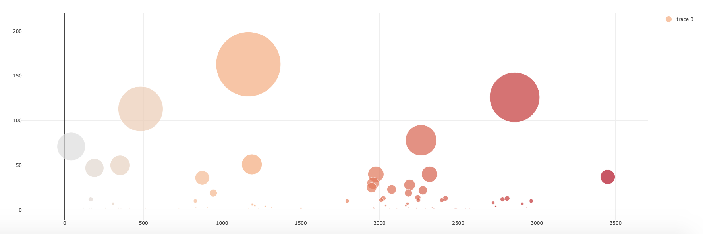

# Interactive_Dashboard
In this project I created a dashboard that displays different plots of the microbes inhabiting our belly buttons. The live version of the app can be found on [Heroku](https://belly-button-microbes.herokuapp.com/).  

The data used for this project comes from the [Belly Button Biodiversity Project](http://robdunnlab.com/projects/belly-button-biodiversity/) that investigates the microbes inhabiting our navels. Based on this data, an interactive dashboard was built to show the metadata (age, type, ethnicity, gender, location) for each individual, the top 10 microbes present in the sample and the sample values for all types of microbes present. 

This project proves my skill of using both front-end as well as back-end developemnet. The following tools were used to bring this project to life:
- SQLalchemy
- Flask
- HTML and CSS
- JS and D3 library

